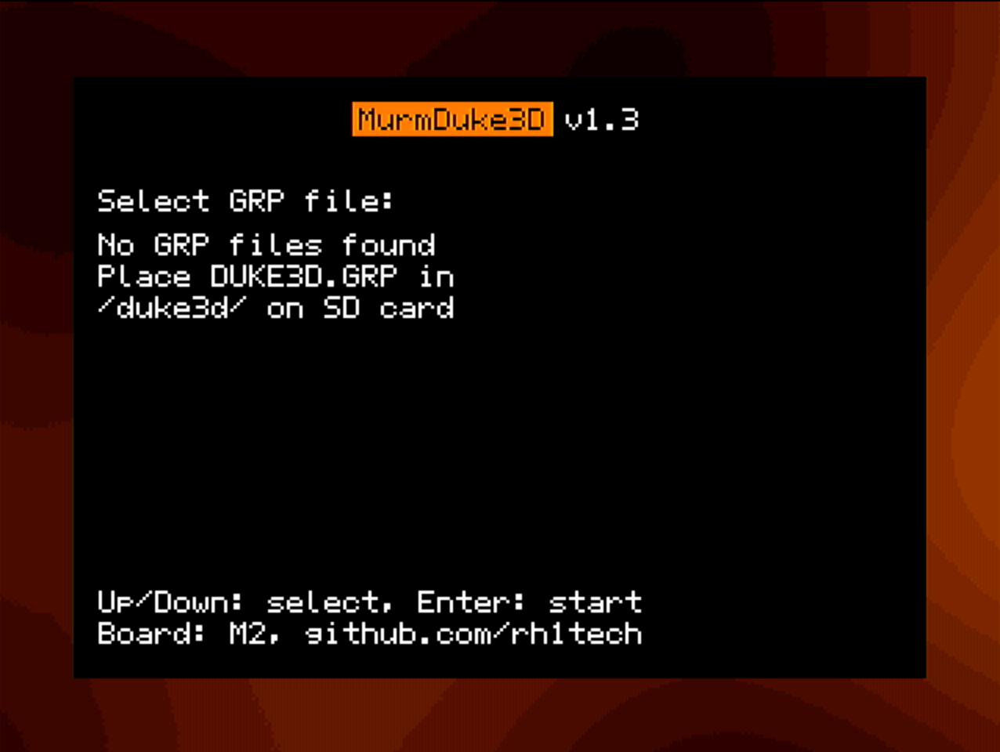
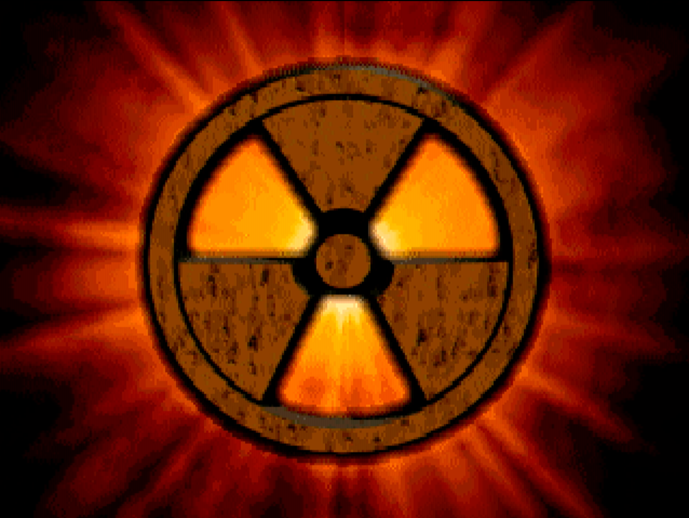
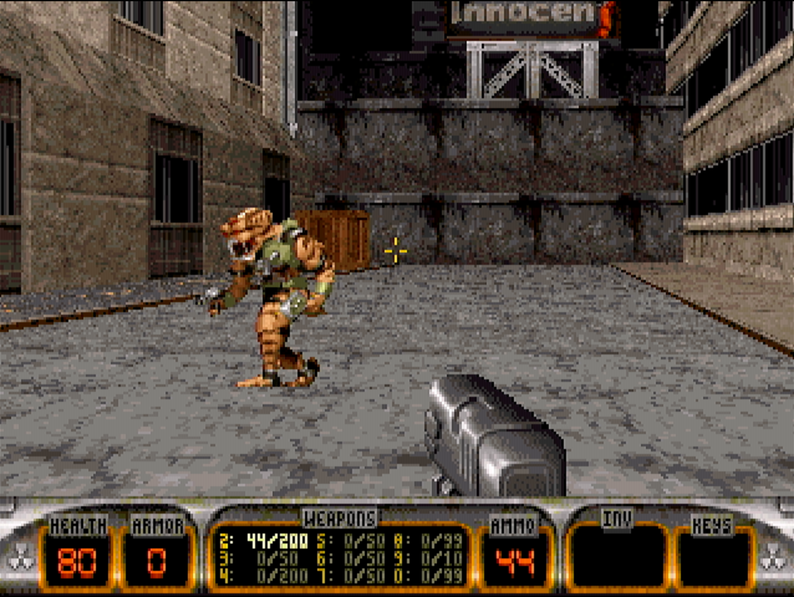
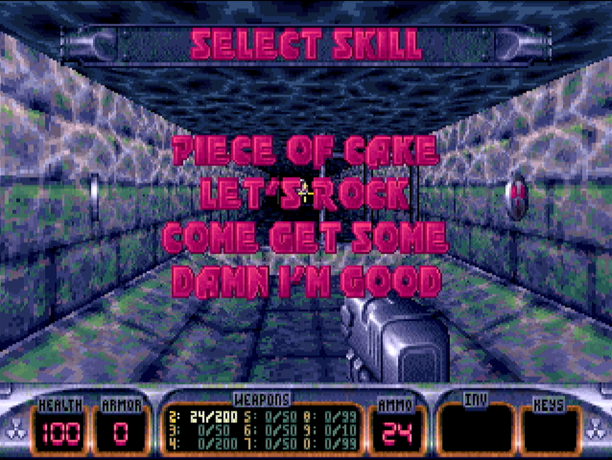

# FRANK Duke3D - Duke Nukem 3D for RP2350

A port of Duke Nukem 3D to the Raspberry Pi RP2350 microcontroller with PSRAM support, HDMI output, and PS/2 keyboard input.

## Features

- Runs on RP2350A and RP2350B with 8MB QSPI PSRAM
- HDMI video output (custom driver)
- PS/2 keyboard support
- SD card for game data (FAT filesystem)
- I2S audio output (TDA1387 DAC)
- Overclocking support (252/378/504 MHz), flash runs on 66 MHz

## Screenshots






## Hardware Requirements

FRANK Duke3D requires a **Pico 2** (RP2350) with **8MB QSPI PSRAM**. It will **not run** on Pico 1 (RP2040).

### Supported Hardware Platforms

This project runs on the following hardware platforms:

- **[FRANK](https://rh1.tech/projects/frank)** - FRANK M1 and FRANK M2 variants
- **[Murmulator](https://murmulator.ru)** - M1 (Murmulator 1) and M2 (Murmulator 2) variants

Both platforms support different Pico versions, but FRANK Duke3D specifically requires Pico 2.

### Obtaining PSRAM-Equipped Hardware

You can obtain PSRAM-equipped hardware in several ways:

1. **Solder a PSRAM chip** on top of the Flash chip on a Pico 2 clone (SOP-8 flash chips are only available on clones, not the original Pico 2)
2. **Build a [Nyx 2](https://rh1.tech/projects/nyx?area=nyx2)** — a DIY RP2350 board with integrated PSRAM
3. **Purchase a [Pimoroni Pico Plus 2](https://shop.pimoroni.com/products/pimoroni-pico-plus-2?variant=42092668289107)** — a ready-made Pico 2 with 8MB PSRAM

### Board Variants

M1 and M2 refer to hardware revisions of Murmulator and FRANK boards. Both variants support either RP2350A or RP2350B chips.

| Function  | M1 GPIO | M2 GPIO |
|-----------|---------|---------|
| SD SCK    | 2       | 6       |
| SD MOSI   | 3       | 7       |
| SD MISO   | 4       | 4       |
| SD CS     | 5       | 5       |
| HDMI Base | 6       | 12      |
| PS/2 CLK  | 0       | 2       |
| PS/2 DATA | 1       | 3       |
| I2S DATA  | 26      | 9       |
| I2S CLK   | 27      | 10      |
| PSRAM CS  | 19 or 47| 8 or 47 |

Both Murmulator and FRANK use **TDA1387** DAC for I2S audio output by default.

## Building

### Prerequisites

- ARM GNU Toolchain
- CMake 3.13+
- Pico SDK 2.0+

### Build Commands

```bash
# Build for M1 board (default, 252 MHz)
./build.sh M1

# Build for M2 board
./build.sh M2

# Build with overclocking
./build.sh M1 378    # 378 MHz
./build.sh M2 504    # 504 MHz
```

### Manual Build

```bash
mkdir build && cd build
cmake -DBOARD_VARIANT=M1 -DCPU_SPEED=378 -DPSRAM_SPEED=133 ..
make -j$(nproc)
```

## Game Data

Copy the following files from your Duke Nukem 3D installation to the `duke3d/` directory on the SD card:
- `DUKE3D.GRP` - Main game data file
- `DUKE.RTS` - Remote ridicule sounds (optional)

Example SD card structure:
```
/duke3d/
    DUKE3D.GRP
    DUKE.RTS
```

## Flashing

Copy `frank-duke3d.uf2` to the RP2350 when in BOOTSEL mode, or use:

```bash
picotool load build/frank-duke3d.uf2
```

## Firmware Variants

Pre-built firmware is available in two clock speed variants for each board type (M1, M2):

| Variant | CPU Clock | PSRAM Clock | Performance |
|---------|-----------|-------------|-------------|
| 378/133 | 378 MHz   | 126 MHz     | Moderate overclock |
| 504/166 | 504 MHz   | 168 MHz     | Maximum overclock |

### Which variant should I use?

**Start with the highest overclock (504/166)** and work your way down if you experience issues.

Not all RP2350 and PSRAM chips are created equal. Due to manufacturing variations (silicon lottery), some chips can run stable at high clock speeds while others cannot. If you experience:

- No video output or blank screen
- Random crashes or freezes
- Graphical glitches or corruption
- Boot failures

Try the 378/133 variant first. You can also build from source with `-DCPU_SPEED=252` for stock clock speeds.

**Note:** Higher temperatures reduce stability margins. If a variant works when cool but fails after extended play, consider using a lower clock speed or adding cooling to your board.

## License

This project is licensed under the GNU General Public License v2.0 - see the [LICENSE](LICENSE) file for details.

### Third-Party Licenses

- **Build Engine** - Copyright (c) 1993-1997 Ken Silverman. See [BUILDLIC.txt](BUILDLIC.txt)
- **Duke Nukem 3D Game Code** - Copyright (c) 1996, 2003 3D Realms Entertainment. Released under GPL v2.
- **Audio Library** - Copyright (c) 1994-1995 Apogee Software, Ltd. James R. Dose. GPL v2.
- **emu8950 OPL emulator** - Copyright (c) 2020 Raspberry Pi (Trading) Ltd. BSD-3-Clause.
- **Pico SDK** - Copyright (c) 2020 Raspberry Pi (Trading) Ltd. BSD-3-Clause.

## Credits

### Original Duke Nukem 3D
- **3D Realms Entertainment** - Game development
- **Ken Silverman** - Build Engine
- **James R. Dose** - Audio library (Apogee Software)

### Based On
- **Jarrad Kirsopp** - [Duke3D ESP32 port](https://github.com/jkirsons/Duke3D)
- **Fabien Sanglard** - [Chocolate Duke3D](https://github.com/fabiensanglard/chocolate_duke3D)
- **DnCraptor** - [QuakeGeneric RP2350 port](https://github.com/DnCraptor/quakegeneric)

### RP2350 Port
- **Mikhail Matveev** (xtreme@outlook.com) - RP2350 port, PSRAM integration, hardware abstraction

### Libraries & Dependencies
- **Raspberry Pi Foundation** - Pico SDK and emu8950 OPL emulator

## Contributing

Contributions are welcome! Please submit pull requests or open issues on GitHub.

## Disclaimer

Duke Nukem 3D is a trademark of 3D Realms Entertainment. This port requires legally obtained game data files. The authors of this port do not provide or distribute copyrighted game assets.
